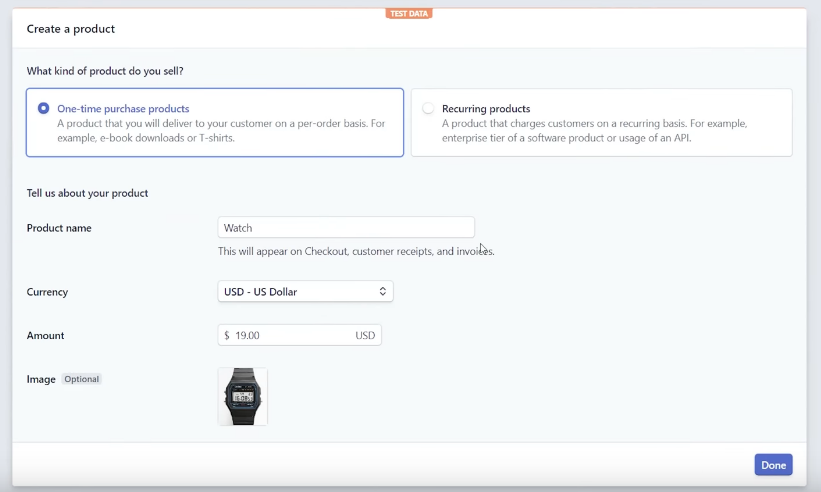
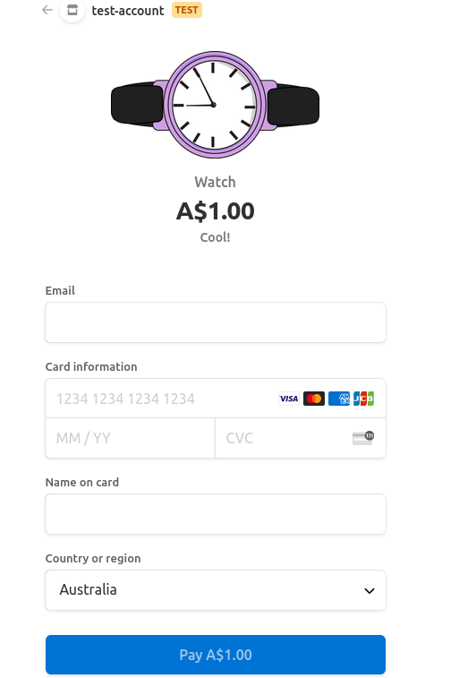
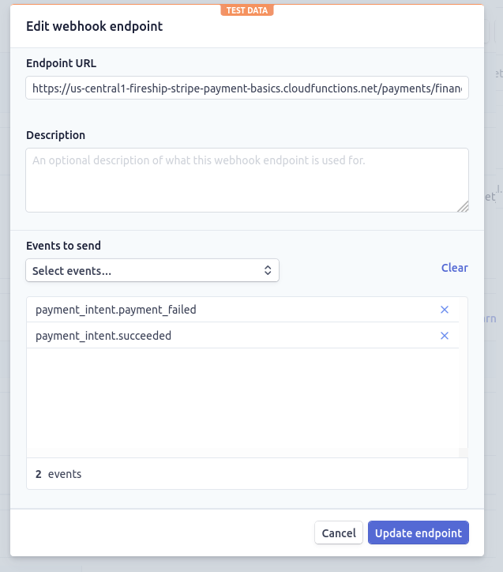

# Stripe Payments Basics

See [this](https://www.youtube.com/watch?v=1XKRxeo9414) tutorial.

Uses:
* Firebase Functions
* Stripe
* Svelte

When we recieve a payment with Stipe, we need to perform an action to fulfil
the customer purchase. We do this using a webhook. (payment_intent.succeeded)

## 01. Stripe

* Have a Stripe account and make sure developer mode is enabled.
* Get your 'Publishable key' under API Keys.

## 02. Create a Product

There are two ways to use Stripe checkout / create a product:

1. Client-only integration
    * The easiest way
    * Involves setting our product information into Stripe
    * Con: cannot calculate pricing dynamically
2. Server-side dynamic pricing ***
   * Involves server-side logic

We will stick to client-side integration, and explore the other in the full
course (Fireship).



We can copy the product ID (sku?) from the page.

## 03. Initialise a Svelte App

Add a Svelte app template.

```
npx degit sveltejs/template svelte-app
cd svelte-app
npm install
npm run dev
```

## 04. Add Stripe to the App

Add the [Stripe API](https://stripe.com/docs/js).

index.html
```html
<script src="https://js.stripe.com/v3/"></script>
```

Product.svelte
```svelte
<script>
  let stripe = Stripe('pk_test_***')
  export let amount;
  export let name;
  export let sku;

  // Function to manage checkout
  // See https://stripe.com/docs/js/checkout/redirect_to_checkout
  async function startCheckout(){
    const { error } = await stripe.redirectToCheckout({
      lineItems: [
        { price: sku, quantity: 1 }
      ],
      mode: 'payment',
      successUrl: 'https://fireship.io/success',
      cancelUrl: 'https://fireship.io/canceled',
    });
    if (error){
      alert('Our payment system is broken!');
    }
  }

</script>

<section>
  <h2>Stripe Checkout</h2>
  <i>{name}</i>
  <button on:click={startCheckout}>Buy me ${amount/100}</button>
</section>
```

app.svelte
```svelte
<script>
  import Product from './Product.svelte';
</script>

<h1>My Svelte Store!</h1>

<Product amount={100} name={'ITS A WATCH!'} sku={'price_***'}/>
```

## 05. Enable Client-Only Integration

Go to https://dashboard.stripe.com/settings/checkout.

Click 'Enable client-only integration'.

We should now be able to access the checkout.



## 06. Enable Back-end Integration

We will initialise firebase functions (we will use TypeScript).

We will install Stripe + Stripe types (allows intellisense).

```
firebase init functions
cd functions
npm i express cors stripe
npm i @types/stripe @types/cors -save-dev
```

We will add to compiler options in tsconfig.json (***):
```
    "lib": ["esnext"]
```

## 06. Create Firebase function

We will create a HTTP function which uses express. (create multiple API
endpoints using a single cloud function)

We can alternatively use 'Callable Functions' - beyond scope.

```ts
...
```

Build and deploy to Firebase:
```
npm run build
firebase deploy
```

## 07. Stripe Webhook and Environment Variables

Add a webhook endpoint in stripe. The endpoint URL is the URL of the function/resource.
`https://us-central1-fireship-stripe-payment-basics.cloudfunctions.net/payments/webhook`



Make sure that the environment variables are present in the .env file:
* STRIPE_SECRET_KEY: API secret from Stripe
* STRIPE_ENDPOINT_SECRET: The signing secret for the webhook in Stripe

!!! Put in manually because I cannot get env vars to work

## 08. Payment Intents API

The client-only checkout is bad for customisability.

We can use the payment intents API + stripe elements to handle custom payments,
customise the checkout, and also handle 3D secure authentication if necessary.

https://youtu.be/1XKRxeo9414?t=537

https://fireship.io/lessons/stripe-payment-intents-tutorial/#strategy-2---payment-intents-with-stripe-elements

1. Backend: Create a payment intent route (firebase functions)
2. Backend: Request stripe for a payment intents object with amount, currency, payment_method_types and metadata
3. Frontend: Request the intent (fetch API or Callable function) provides the client secret
4. Frontend: Collect card details using Stripe elements
5. Frontend: Submit payment to Stripe (stripe.handleCardPayment)

Then the payment is fulfilled using a webhook.

See https://github.com/stripe/stripe-node/blob/master/examples/webhook-signing/typescript-node-express/express-ts.ts

Cannot validate webhook signature:

{ Error: No signatures found matching the expected signature for payload. Are you passing the raw request body you received from Stripe? https://github.com/stripe/stripe-node#webhook-signing